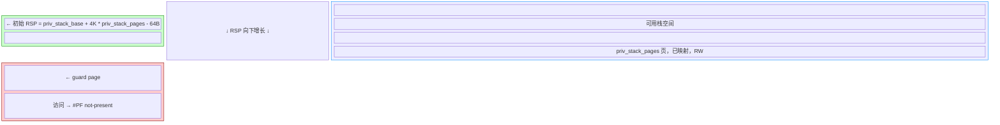

# priv_stack 布局图

## 总览



## 精确地址

```
高位
  ┌──────────────────────────────────────────────┐
  │  priv_stack_base + 4K * pages - 64B          │ ← 初始 RSP (priv_ctx.rsp)
  │                                              │   留 64B 作 RBP 回溯缓冲区 (FRED 兼容)
  ├──────────────────────────────────────────────┤
  │                                              │
  │              可用栈空间                       │
  │        priv_stack_pages 页, RW               │
  │                                              │
  │   栈向下增长 (push 使 RSP 减小)               │
  │                                              │
  │   push → RSP -= 8                            │
  │   call → RSP -= 8                            │
  │   sub rsp, N → RSP -= N                     │
  │                                              │
  ├──────────────────────────────────────────────┤
  │  priv_stack_base                             │ ← 栈顶 (最低可访问地址)
  │                                              │   再往下就撞 guard page
  ├──────────────────────────────────────────────┤
  │  [base - 4K, base)                            │ ← guard page
  │  未映射，访问触发 #PF not-present              │
  │  捕获栈溢出（下溢）                             │
  └──────────────────────────────────────────────┘
低位
```

## 字段定义

| 字段 | 含义 | 对齐 |
|------|------|------|
| `priv_stack_base` | 栈顶（可用栈最低地址） | 4K 对齐，低 12 bit 强制为 0 |
| `priv_stack_pages` | 可用页数（不含 guard page） | — |

## 地址计算

```
priv_stack_base  = stack_alloc(&kurd, priv_stack_pages)
                 = vaddr + 0x1000                 // kernel path
                 = raw  + 0x1000                  // USER_MODE path

guard page       = [priv_stack_base - 4K, priv_stack_base)
                   占用 VM 地址区间，无物理分配，无页表映射

可用栈            = [priv_stack_base,
                    priv_stack_base + 4K * priv_stack_pages)
                   已映射，RW

初始 RSP          = priv_stack_base + 4K * priv_stack_pages - 64B
```

## 调用方示例

```c
// 分配 2 页可用 + 1 页 guard
task* t = task::basic_constructor();
t->priv_stack_base  = stack_alloc(&kurd, 2);   // 返回 priv_stack_base
t->priv_stack_pages = 2;

// 设置初始 RSP
t->priv_ctx.rsp = t->priv_stack_base + 4K * 2 - 64;
```

## 物理/虚拟资源分配

```
stack_alloc(2) 的参数 _4kbpgscount = 2:

  物理分配 (FreePagesAllocator):
    alloc(2 * 4K)  →  2 页物理内存 (仅可用页)

  虚拟分配 (kspace_vm_table):
    alloc_available_space(3 * 4K)
    → 3 页虚拟地址:  [vaddr, vaddr + 12K)

  VM_DESC:
    .start = vaddr, .end = vaddr + 12K
    覆盖 guard + usable 全部虚拟区间

  页表映射 (enable_VMentry):
    只映射: [vaddr+4K, vaddr+12K)  →  2 页
    [vaddr, vaddr+4K) 无 PTE → guard page
```

## 常见误解

| ❌ 错误理解 | ✅ 正确理解 |
|---|---|
| `priv_stack_base` 是栈底（高地址） | `priv_stack_base` 是栈顶（低地址），guard page 在其下 |
| guard page 需要物理页 | guard page 只需占 VM 坑位，无物理分配 |
| `priv_stack_pages` 包含 guard | `priv_stack_pages` = 可用页数，guard 是额外 1 页 |
| 初始 RSP 在栈的最低处 | 初始 RSP 在栈的最高处，向下增长到 `priv_stack_base` |
